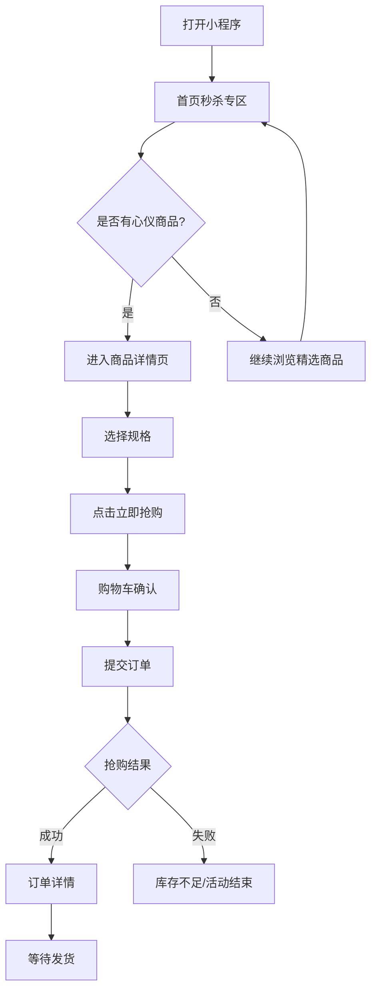

# 商场秒杀小程序 - 产品需求文档（PRD）

## 1. 产品概述

**项目名称**：商场秒杀小程序
**项目类型**：移动端电商秒杀应用
**一句话介绍**：一款专注于限时秒杀场景的商场购物小程序，为用户提供抢购潮品尖货的流畅体验。
**核心价值**：通过倒计时、限量抢购、实时库存等机制，营造紧张刺激的购物氛围，帮助用户发现高性价比商品。
**目标用户**：追求潮流、注重性价比的年轻消费者（18-35岁），热衷抢购限时折扣商品。

---

## 2. 核心功能模块

### 2.1 用户角色

| 角色 | 说明 | 核心权限 |
|------|------|----------|
| 游客用户 | 无需登录即可浏览商品和秒杀活动 | 浏览首页/商品/秒杀活动 |
| 注册用户 | 完成手机号注册并登录 | 参与秒杀、下单、收藏、查看订单 |

### 2.2 功能模块列表

**模块一：首页（Home）**
- 顶部搜索栏（支持关键词搜索商品）
- 秒杀活动横幅轮播（多张活动Banner自动切换）
- 限时秒杀专区（展示正在进行和即将开始的秒杀场次，每场倒计时）
- 精选商品列表（瀑布流/网格布局展示商品卡片）
- 底部导航栏（首页/分类/购物车/我的）

**模块二：商品详情页（Product Detail）**
- 商品主图展示（支持图片放大预览）
- 商品基本信息（名称、价格、规格）
- 秒杀价格与倒计时（醒目展示折扣力度）
- 库存实时显示（剩余件数）
- 规格选择器（颜色/尺码/容量）
- 加入购物车 / 立即抢购按钮
- 商品详情描述（图文详情）

**模块三：购物车（Cart）**
- 商品列表（图片、名称、单价、数量）
- 单选/全选功能
- 数量增减操作
- 删除商品
- 价格汇总（原价 vs 秒杀价对比）
- 去结算按钮

**模块四：个人中心（Profile）**
- 用户头像与昵称
- 订单入口（待付款/待发货/待收货/已完成）
- 收货地址管理
- 收藏商品列表
- 优惠券入口
- 设置（退出登录等）

---

## 3. 核心用户流程

### 3.1 秒杀抢购流程

```
用户打开小程序
    ↓
浏览秒杀专区，发现心仪商品
    ↓
点击商品进入详情页
    ↓
选择规格，阅读秒杀规则
    ↓
点击"立即抢购"
    ↓
进入购物车确认商品
    ↓
提交订单（模拟支付）
    ↓
抢购成功/失败提示
```

### 3.2 流程图



---

## 4. 用户界面设计

### 4.1 设计风格

- **设计理念**：现代轻量、年轻活力、紧迫感驱动
- **视觉风格**：扁平化卡片设计 + 微妙阴影层次，圆角适中
- **主色调**：
  - 主色：`#FF4757`（活力红，代表抢购紧迫感）
  - 辅助色：`#FF6B81`（浅红，用于hover/次级按钮）
  - 点缀色：`#FFD700`（金色，用于秒杀标签/价格高亮）
  - 背景色：`#F8F9FA`（浅灰白，页面底色）
  - 文字色：`#1A1A2E`（深色标题）、`#6C757D`（次级文字）
- **按钮样式**：全圆角胶囊按钮，主按钮红色实心，次按钮描边
- **字体**：标题使用粗体 sans-serif（如 `PingFang SC Bold`），正文使用常规
- **布局风格**：移动端优先，单列/双列网格，卡片式模块
- **图标风格**：线性图标（Lucide图标库）

### 4.2 关键UI元素

| 元素 | 样式 |
|------|------|
| 秒杀倒计时 | 红色圆角胶囊，内含时分秒数字，字号醒目 |
| 商品卡片 | 白色圆角卡片，阴影，`¥`价格高亮，秒杀标签角标 |
| 底部导航 | 固定底部，4个Tab图标+文字，选中态红色高亮 |
| 立即抢购按钮 | 全宽红色渐变按钮，圆角12px，hover微放大动效 |
| 购物车数量角标 | 右上角红色圆形数字角标 |

### 4.3 动效设计

- 页面加载：骨架屏（Skeleton）占位，防止布局跳动
- 商品卡片入场：淡入+上移（opacity 0→1, translateY 20px→0, 100ms延迟递增）
- 秒杀倒计时：秒数字每秒跳动（scale微缩放）
- 按钮点击：scale 0.95 按压反馈
- Tab切换：下划线滑动指示器过渡（300ms ease）

### 4.4 响应式设计

- 移动端优先设计（主要适配 375px-428px 屏幕）
- 商品网格：2列布局，间距 12px
- 图片自适应：aspect-ratio 保持统一比例
- 触摸优化：所有可点击区域最小 44px

---

## 5. 页面结构

| 页面 | 路由 | 说明 |
|------|------|------|
| 首页 | `/` | 秒杀专区 + 商品列表 |
| 商品详情 | `/product/:id` | 单品详细信息 + 抢购 |
| 购物车 | `/cart` | 已选商品列表 |
| 个人中心 | `/profile` | 用户信息 + 订单入口 |

---

## 6. 产品约束

- 所有数据为 Mock 模拟数据（无真实后端API）
- 不需要真实支付功能，提交订单后显示模拟成功提示
- 秒杀倒计时实时刷新，库存为预设数值
- 支持本地存储（localStorage）保存购物车状态
